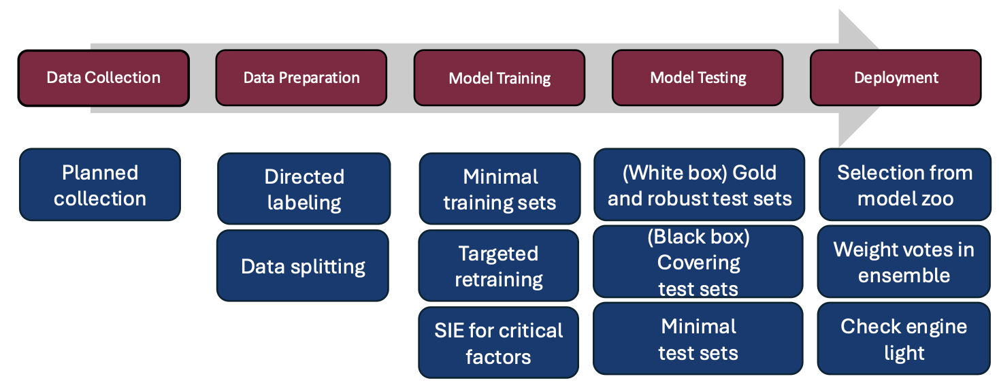

# <div align="center"> CODEX: Coverage of Data Explorer </div>
The Coverage of Data Explorer (CODEX) tool is a Python package that implements data coverage metrics and algorithms for artificial intelligence (AI)/machine learning (ML) test and evaluation (T&E) applications. CODEX’s metrics are based on the theory of combinatorial testing (CT) adapted from software testing to AI/ML T&E with a data-centric focus. 

As a data assurance tool, CODEX requires datasets for all functionalities. Some functionalities additionally require ML training algorithms and a mechanism for automatically training models and evaluating them on a test set (a test harness). CODEX provides functionalities such as:

- Evaluation of the coverage of a defined universe by a dataset, which may be used for applications such as selecting a model for deployment domain
- Between dataset coverage, which may be used for applications such as computing the difference between a test and training set to generate representative and challenging test sets
- Systematic inclusion/exclusion framework (SIE), which is used for identification of critical metadata factors
- Data splitting algorithms, which may be used to construct balanced data sets for training or testing. The SIE framework uses the data splitting algorithm for constructing a balanced universal test set. In the future, this framework could use the same algorithm to produce training sets that are not only covering but also balanced. 
- Prioritization of samples to best cover a space, which may be used to support high information gain in resource restricted scenarios such as labeling and retraining

 
CODEX produces visualizations to characterize the data and the resulting model, such as:
- Binary coverage: the interactions that are present/absent 
- Frequency coverage: the proportion of dataset samples containing each interaction
- Performance by interaction: how the model performs on data containing each interaction 
- Performance by frequency: model performance as a function of frequency coverage
- Performance by coverage: how models trained on datasets with different degrees of coverage perform and how performance differs as a function of distance between the training and testing dataset

# Table of contents
- [Theory and Background](#theory-and-background)<br/>
- [User Setup, Install, and Execution](#user-setup-install-and-execution)<br/>
- [Running CODEX: How to and Examples](#running-codex-how-to-and-examples)<br/>
- [CODEX experiment requirements (all modes)](#requirements-for-all-codex-modes)<br/>
- [CODEX experiment requirements (mode-specific)](#requirements-for-specific-codex-modes)<br/>
- [References](#references)
- [Contact](#contact)

Additional:
- [CODEX mode descriptions](resources/mode_descriptions.md)<br/>
- [Input file descriptions](resources/input_field_descriptions.md)<br/>
- [Split and performance file formatting](resources/split_performance_formatting.md)

# Theory and Background

## Essential Theory
The metrics implemented in CODEX, combinatorial coverage (CC) and set difference combinatorial coverage (SDCC), compute how much of the input space is covered by an ML dataset of samples [1](#1). CC computes how much of a defined universe is covered by a specific dataset. SDCC computes how much of the input space is covered by one dataset but not another. 

As combinatorial testing metrics, both CC and SDCC require a defined universe, called an "input parameter model" (IPM) in combinatorial testing. The IPM consists of a set of *k* factors (sometimes called variables) and each of the factors takes on some finite number of values (sometimes called levels). For the application to ML, features or metadata features are factors of the IPM. Continuous valued factors need to be discretized via a binning scheme. How to choose a binning scheme is largely out of scope for this readme, but some options are bins with equal sized ranges, bins drawn to contain  an equal number of samples, while the best binning schemes likely group semantically meaningful values and are depedent on application domain. A *t*-way combination of factors is a selection of *t* of the factors; there are (k choose t) combinations. The size of combination is also called the strength, and *t* can take values from 1 to *k*. A *t*-way interaction (sometimes called a variable-value combination) is an assignment of values to the *t* factors. The number of *t*-way interactions is computed as the sum of the number of choices for each of the combinations.  We typically demonstrate for *t*=2 for a minimal but meaningful example.

Let *U* be the universe of all possible samples in terms of the factors and their values and *U<sub>t</sub>* be the set of *t*-way interactions possible in the universe. Let |*U<sub>t</sub>*| be the number of possible *t*-way interactions. If any interaction is not possible, it can be removed as a constraint. Given a dataset *D* as a subset of *U*, *D<sub>t</sub>* is the set of *t*-way interactions appearing in *D* and |*D<sub>t</sub>*| is the size of this set. CC<sub>*t*</sub> is the proportion of the possible *t*-way interactions that are also present in *D*. 


Let *S* be one dataset, such as the training dataset, and let *T* be another dataset, such as the test dataset. Let \ denote set difference. SDCC<sub>*t*</sub>(T<sub>t</sub>\S<sub>t</sub>) is the proportion of the *t*-way interactions that appear in *T* but not in *S*.  


Computing SDCC bidirectionally, that is, SDCC<sub>*t*</sub>(T<sub>t</sub>\S<sub>t</sub>) and SDCC<sub>*t*</sub>(S<sub>t</sub>\T<sub>t</sub>), is sufficient to identify which of the five coverage relationships holds between *S* and *T*.


When we have labeled datasets, we can compute coverage by excluding the label column ("label-exclusive counting"), requiring the label column to be part of each combination ("label-centric counting") and choosing *t-1* other factors, or treating the label column just like the feature columns ("non-label-centric counting"). Different applications may require a different method of counting. By forcing the label to be in each combination, label-centric counting gives us information about the contexts in which labels are seen. This may be useful in object detection or in developing an explainable classifier. When we do not or cannot know which labels exist in a sample, label-exclusive counting may be the only option, such as in directed data labeling. We are not aware of a natural application for non-label-centric counting.

# Simple Demonstration

As a simple demonstration, consider the first tabular dataset below and let the universe, *U*, be defined: Hair={Yes, No}, Live Birth={Yes, No}, Ecosystem={Ocean, Woods, Desert, Arctic}. Each of the four rows represents a sample. The three factors are {Hair, Live Birth, Ecosystem}. The Class column is the label and Sample ID is a unique ID that is not involved in coverage computations. Using label-exclusive counting, 2-way combination examples are {Hair, Ecosystem} and {Hair, Live Birth}. 2-way interaction examples are {(Hair, No),(Ecosystem, Ocean)} and {(Ecosystem, Ocean), (Live Birth, Yes)}. Computing the 2-way combinations of the universe yields (k choose t) = (4 choose 2) = 6 and |*U<sub>t</sub>*| = (2 * 2) + (2 * 4) + (2 * 4) = 20. Of these, 3 + 4 + 3 = 10 are present, so CC<sub>t</sub>(First) = 10 / 20 = 50%. The missing interactions are: 
{(Hair, Yes),(Live Birth, No)}, 
{(Hair, Yes),(Ecosystem, Arctic)}, {(Hair, No),(Ecosystem, Arctic)}, 
{(Hair, Yes),(Ecosystem, Desert)}, {(Hair, No),(Ecosystem, Desert)}, 
{(Live Birth, Yes),(Ecosystem, Arctic)}, {(Live Birth, No),(Ecosystem, Arctic)}, 
{(Live Birth, Yes),(Ecosystem, Desert)}, {(Live Birth, No),(Ecosystem, Desert)}, 
{(Live Birth, No),(Ecosystem, Ocean)}}.

| Sample ID | Hair | Live Birth | Ecosystem | Class |
| ----------- | ----------- | ----------- | ----------- | ----------- |
|1 | No   | Yes  | Ocean  | Orca |
| 2 | Yes  | Yes  | Woods  | Wolf |
|3 | Yes  | Yes  | Ocean  | Otter |
|4 | No  | No | Woods | Owl |

Now consider a second tabular dataset. The CC<sub>2</sub> = (3 + 4 + 4) / 20 = 11 / 20 = 55%. The Second dataset covers 5% more of the universe than First.
The missing interactions are: 
{(Hair, Yes),(Live Birth, No)}, 
{(Hair, No),(Ecosystem, Arctic)}, 
{(Hair, Yes),(Ecosystem, Desert)}, {(Hair, No),(Ecosystem, Desert)}, 
{(Hair, Yes),(Ecosystem, Ocean)},
{(Live Birth, No),(Ecosystem, Arctic)}, 
{(Live Birth, Yes),(Ecosystem, Desert)}, {(Live Birth, No),(Ecosystem, Desert)}, 
{(Live Birth, No),(Ecosystem, Ocean)}}.

| Sample ID | Hair | Live Birth | Ecosystem | Class |
| ----------- | ----------- | ----------- | ----------- | ----------- |
|1 | No   | Yes  | Ocean  | Orca |
| 2 | Yes  | Yes  | Woods  | Wolf |
|3 | Yes  | Yes  | Arctic  | Fox |
|4 | No  | No | Woods | Owl |

SDCC<sub>2</sub>(Second \ First) = 2 \ 11 = 18%. The interactions in the set difference are
{(Hair, Yes),(Ecosystem, Arctic)}, {(Live Birth, Yes),(Ecosystem, Arctic)}.

SDCC<sub>2</sub>(First \ Second) = 1 \ 10 = 10%. The interaction in the set difference is
{(Hair, Yes),(Ecosystem, Ocean)}.

These datasets fall into coverage relationship three: the intersection is non-empty and neither is a subset of the other.

## Applications
Combinatorial coverage may be useful for characterizing the input space for a number of T&E applications. 

- "What is the operating envelope of my model?" CC provides a measure of how much of a defined universe is covered by a dataset. When the universe is the intended operating environment for a model trained on that dataset, datasets that better cover the universe may produce models with better performance [2](#2).
- "Can I transfer this model from one domain to another?" SDCC provides a measure of the distance between a source and target domain for transfer learning. SDCC has been demonstrated to correlate with the direction of a performance drop in zero shot transfer [1](#1).
- "How do I differentiate a model's ability to perform in regions where it should have learned from its ability to generalize to new regions?" Test samples with interactions covered by the training dataset were demonstrated to have higher accuracy than samples with some interactions not covered. This leads to constructions for representative test sets (low SDCC between test and train) and challenging test sets (high SDCC between test and train) [2](#2).
- "What are the top information gain data points for improving the model in transfer learning?" Retraining a source model by augmenting with a few target domain images identified using the set difference achieved higher accuracy than augmenting with the same number of images selected randomly [3](#3).
- "What are the dimensions of my model's operating envelope? Can I know in advance when I'm leaving it?" Combinatorial testing and design of experiments concepts are useful for the construction data splitting algorithm and systematic inclusion/exclusion framework to identify the critical factors impacting a model's performance. The (overly simplified) idea of the framework is to systematically withhold interactions from the training dataset for a model (within a constellation), evaluate the model on both the covered and uncovered partitions of a (universal) test set, and compare the delta in performance of the model(s) on covered and uncovered partitions  [4](#4).
- "How can I direct collection or labeling activities given a limited budget?" Given the demonstrated value of coverage for model performance, algorithms that priorize collecting or labeling samples in the uncovered or undercovered space are obvious. 

Evidence to support all of the below T&E applications exists, but not all have been implemented in CODEX (yet).

# User Setup, Install, and Execution
CODEX was developed on Python >= 3.10. Requirements can be installed from pyproject 

### Installing CODEX package:
CODEX can be installed to Pythonpath as a package to be imported in other Python scripts.

Either run:
```bash
pip install codex
```

or:
```bash
git clone git@github.com:leebri2n/CODEX.git
cd CODEX
pip install .
```

### Running CODEX package:
As a module in Python code, include:
```python
import codex
input_dict = {...} # Read in from JSON file
codex.run(input_dict, verbose=1)
```

### Installing CODEX for Command Line Interface (CLI) use:
CODEX may be used directly from the repository directly in the Command Line Interface (CLI) by running `CODEX/codex/codex.py`
```bash
git clone git@github.com:leebri2n/CODEX.git # SUBJECT TO CHANGE
cd CODEX
pip install -r requirements.txt
```

### Running CODEX through the CLI
Within `CODEX/`, run 
```bash
python codex/codex.py input=path/to/input/file verbose=[0/1/2]
```

### CODEX verbosity
CODEX supports three levels of verbosity. These values dictate types of output to logger files when running an experiment.
- Level 0, Warning: Warnings for incompatibility, user error, etc.
- Level 1, Informational: Experiment variables, information, and key results
- Level 2, Debugging/Tracing: intermediate variables, counts, etc.

<!-- ~~~~~~~~~~~~~~~~~~~~~~~~~~~~~~~~~~~~~~~~~~~~~~~~~~~~~~~~~~~~~~~~~~~~~~~~~~~~~~~~~~~~~~~~~~~~~~~~~~~~~~~~~~~~~~~~~~~~~~~~~ -->
# Running CODEX: How to and Examples
## Input file
Using any CODEX mode requires an input configuration in the form of a JSON file or a `dict` object with the proper fields. Consider the [input file template](configs/input_TEMPLATE.json), in `configs/`. The template file contains the current exhaustive list of parameters for any given CODEX mode. 

Template `input_TEMPLATE.json`:
```JSON
{
    "mode" : "<dataset evaluation>, <dataset split evaluation>, <dataset split comparison>, <performance by interaction>, <model_probing>",
    "dataset_name" : "<name of dataset for output>",
    "model_name" : "<name of model for output>",
    
    "codex_directory" : "<directory where materials for CODEX experiments reside>",
    "config_id" : "<codex_directory>/<experiment ID as output directory>",

    "data_directory" : "<pathway to data directory>",
    "dataset_file" : "<data_directory>/<path to dataset file>",
    "sample_id_column" : "<name of column designating sample id>",
    "label_column": "name of column designating labels/classes",
    "features" : ["<feature names>"],

    "bin_directory": "<directory of binning file relative to codex_directory>",
    "bin_file" : "binning/<pathway to binning file>",
    "universe": "<dictionary of universe>,<pathway to universe JSON file>, null if using binning file",
    "use_augmented_universe": false,
    "counting_mode" : "<label_exclusive>/<label_inclusive>",
    "t": "list of t-way combination strengths, [1,2,3,...]",

    "split_folder": "<codex_directory>/<name of folder containing split>",
    "split_file" : "<list of split files>/<name of single split file>",
    "performance_folder": "<codex_directory>/<name of folder containing performance>",
    "performance_file" : "<list of corresponding performance files>/<name of single performance file>",   
    "metric": "<name of performance metric as in performance file>",

    "timed_output": true
}
```
A more thorough explanation of each input parameter can be found [here](resources/input_field_descriptions.md).

## Running CODEX through the Command Line Interface
The following is a step-through example of how a dataset evaluation experiment for CODEX might be prepared and executed through the command line method. The dataset being evaluated is metadata radio frequency machine learning (RFML) data generation parameters for RF signals. 

#### 1. Install CODEX requirements
Follow the steps [above](#installing-codex-as-package) and in the command line, navigate to the root directory, `CODEX/`.
```bash
git clone git@github.com:leebri2n/CODEX.git # SUBJECT TO CHANGE
cd CODEX
pip install -r requirements.txt # If dependencies not installed.
```

#### 2. Fill input file
At the root directory, open the input JSON file under `examples/rfml_demo/config_rfml_demo-dataset_eval.json` to edit parameters for the experiment.
- Under `"codex_directory"` specify the correct codex directory relative to root directory. A CODEX directory is one in which all of the inputs, outputs, dataset files, binning schemes, etc. relating to a dataset lie. Specify the correct CODEX directory for the RFML experiment. 
    - Hint: The directory is one in which `config_rfml_demo-dataset_eval.json` is stored. Make sure to include `examples/`. 
    - For this experiment, enter: `"examples/rfml_demo/"`
- Under `"mode"`, specify the CODEX mode to be run, dataset evaluation. Search the mode keyword in the [modes section](resources/mode_descriptions.md)
    - For this experiment, enter: `"dataset evaluation"`
- Under `"bin_file"`, select a binning scheme offered in the CODEX directory.
    - Choose one of two binning schemes provided in `examples/rfml_demo/`. (`bins.txt.`/`bins_small.txt`)

**NOTE: For simplicity all other fields in the input file have been provided. A list explaining each field can be found [here](resources/mode_descriptions.md)**

#### 3. Execute `codex.py`
Still in the root directory, execute `python codex/codex.py` specifying the input file location and [verbosity level](#codex-verbosity).
```bash
python codex/codex.py input=examples/configs/config_rfml_dataeval-demo.json verbose=0/1/2
```

#### 4. View results
Results of the dataset evaluation include: 
- Under `coverage.json`:
    - Combinatorial coverage value (CC)
    - Feature combination names
    - Counts of interactions
    - Missing interactions
- Coverage maps
    - Binary coverage map
    - Proportion frequency coverage map


## Running CODEX as a Python module
A Jupyter notebook provided in the `examples/` folder demonstrates how CODEX as a module is run on a version of the RarePlanes dataset and results are viewed and obtained. A completed version can be found [here](examples/ctdemo_codex_completed.ipynb). 

# Requirements for all CODEX modes
CODEX offers several modes of dataset exploration with a combinatorial approach. A full list of the modes and explanations can be found [here](resources/mode_descriptions.md).

## Input File
CODEX relies on a user-specified JSON input file to define the parameters and locate the necessary components of the experiment. More detail on the meaning of each field in the input file can be found [here](resources/mode_descriptions.md).

## 1. Tabular Dataset
CODEX computes over a tabular dataset whose rows are data on a single observation and whose columns are features, or variables, of the data. For the many cases in which a machine learning dataset is not in a tabular format, a meta-dataset containing derived features of the corresponding data stands as a surrogate for the dataset in CODEX.


## 2. Universe and/or Binning files
The metrics CODEX implements, including combinatorial coverage and set difference combinatorial coverage, are computed with respect to a defined universe. In other words, CC and SDCC are only as helpful insofar as how accurately the universe describes the operating envelope of a dataset, so universe definition is requires user discretion through three possible methods.

1. Providing universe JSON file/dictionary:
    - In the input file, store a dictionary or location to JSON file relative to CODEX directory under the "universe" field.
    - Universe dictionary has "features" and "levels" keys.
2. Binning file:
    - In the input file, write location to binning file under "binning" relative to codex directory.
    - Specify continous features and values to discretize
    - Optionally specify discrete features to reorder

```txt
bins.txt
feature_1: [0,5);[5,10);[10,15);[15,20]
feature_2: red;blue;green
feature_3: [0,50);[50,100]
```

Ensure that proper interval notation covers values between a defined minimum and maximum. Ensure that each feature is separated by a new line and each level is separated by ";". <!-- Subject to change if binning file is dict -->

3. Learning from the dataset:
    - In the input file, store as null
    - CODEX will attempt to automatically bin continuous variables by reading from dataset and return a universe used for an experiment.

# Requirements for specific CODEX modes

## 3. Split files
Split files are dictionaries of lists specifying sample ID's belonging to each split keyed under the split's name. "train," "validation," and "test" or "test_probe" and "test_exploit" are the only supported entries. 

Sample ID's in this file MUST match those that identify samples in the tabular dataset.

Example: `split_x_.json`
```JSON
{
    "split_id": "split_x_",
    "train": ["img1", "img2", "img3", "..."],
    "validation": ["img74", "img75", "img76", "..."],
    "test": ["img88", "img99", "img100", "..."]
}
```

** Modes using split files: dataset split evaluation, dataset split comparison, performance by interaction, model probing **

## 4. Performance Files
Performance files are dictionaries containing performance metrics from model evaluation computed prior to the experiment. 

Performance files contain information on split file from which model performance resulted and overall model performance on the test partition. For some CODEX modes, results of model inference at the sample level is required. This per-sample performance is stored under "Per Sample Performance" on the same level as "Overall Performance." `dataset split comparison` only requires overall performance, while `performance by interaction requires` per-sample performance.

In per-sample performance, sample ID's in this file must match those that identify samples in the tabular dataset. Any number of performance metrics can be stored under the "Overall Performance" and "Per-Sample Performance" fields.

Example: `performance_x_.json`
```JSON
{
    "split_file": "split_x_.json",
    "subset": "test": {
        "Overall Performance": {
            "precison": 0.5,
            "recall": 0.4,
            "f1": 0.444
        },
        "Per Sample Performance": {
            "img99": {
                "precision": 0.3, 
                "recall": 0.25
            },
            "img88": {
                "precision": 0.25,
                "recall": 0.64
            },
            "..."
        }
    }
}
```

** Modes using performance files: dataset split comparison, performance by interaction, model probing **

# References
<a id="1">[1]</a> 
E. Lanus, L. J. Freeman, D. R. Kuhn and R. N. Kacker, "Combinatorial Testing Metrics for Machine Learning," in *2021 IEEE International Conference on Software Testing, Verification and Validation Workshops (ICSTW)*, pp. 81-84. [DOI: 10.1109/ICSTW52544.2021.00025](https://doi.org/10.1109/ICSTW52544.2021.00025)


<a id="1">[2]</a> 
T. Cody, E. Lanus, D. D. Doyle, and L. J. Freeman, "Systematic training and testing for machine learning using combinatorial interaction testing," in *2022 IEEE International Conference on Software Testing, Verification and Validation Workshops (ICSTW)*, pp. 102-109. [DOI: 10.1109/ICSTW55395.2022.00031](https://doi.org/10.1109/ICSTW55395.2022.00031)

<a id="1">[3]</a> 
S. F. Ahamed, P. Aggarwal, S. Shetty, E. Lanus and L. J. Freeman, "ATTL: An Automated Targeted Transfer Learning with Deep Neural Networks," in *2021 IEEE Global Communications Conference (GLOBECOM)*, pp. 1-7. [DOI: 10.1109/GLOBECOM46510.2021.9685826](https://doi.org/10.1109/GLOBECOM46510.2021.9685826)

<a id="1">[4]</a> 
E. Lanus, B. Lee, L. Pol, S. Sobien, J. Kauffman, and L. J. Freeman, "Coverage for Identifying Critical Metadata in Machine Learning Operating Envelopes," in *2024 IEEE International Conference on Software Testing, Verification and Validation Workshops (ICSTW)*, 2024, pp. 217- 226. [DOI: 10.1109/ICSTW60967.2024.00050](https://doi.org/10.1109/ICSTW60967.2024.00050)

# Contact
CODEX is the implementation of academic research into coverage as a method for <a href="https://data-assurance.vt.domains">data assurance</a> within AI/ML. For questions about our research or specific questions about CODEX, please contact <a href="mailto:lanus@vt.edu">lanus@vt.edu</a>.


